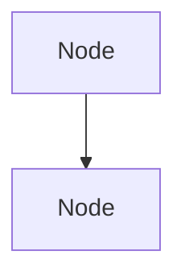

# Excalidraw Diagram Generator

## When to Use
Activate when asked to create diagrams, architecture maps, flowcharts, or visual representations using Excalidraw format.

## The Process

### Step 1: Understand the Diagram Goal
- What system/process/concept needs to be visualized?
- Who is the audience (technical/non-technical)?
- What level of detail is needed?

### Step 2: Identify Components
- List all nodes (services, components, steps, entities)
- Define relationships and connections
- Note groupings or clusters

### Step 3: Generate Excalidraw Structure
Produce a structured text representation:

```markdown
## Nodes
[NodeID] Label (type: rectangle/diamond/circle/ellipse)
  - Position: [x, y]
  - Color: [color]
  - Notes: [optional description]

## Connectors
[FromNodeID] --> [ToNodeID]
  - Label: [relationship description]
  - Style: [solid/dashed]
  - Arrow: [none/one/both]

## Groups
[GroupName]: [NodeID1, NodeID2, ...]
```

### Step 4: Provide Mermaid Alternative
Also generate a Mermaid diagram code as fallback:



## Constraints
- Keep diagrams readable — max 15 nodes per diagram
- Use consistent naming conventions
- Always include a legend for complex diagrams
- Prefer horizontal flow for processes, vertical for hierarchies

