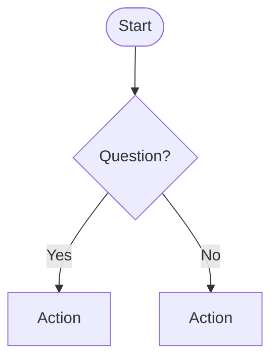

# Flowchart Decision Builder

## When to Use
Activate when asked to create flowcharts, decision trees, process flows, troubleshooting guides, or branching logic diagrams.

## The Process

### Step 1: Define the Starting Point
- What is the initial question or entry condition?
- Who is following this flow?
- What is the end goal?

### Step 2: Map Decision Nodes
For each decision point:
- **Question:** Clear yes/no or multiple-choice question
- **Conditions:** What determines each branch
- **Outcomes:** What happens on each path

### Step 3: Generate the Flowchart
Produce both structured text and Mermaid code:

```markdown
## Decision Flow: [Title]

### Start > [First Question]
- **YES** > [Next step/decision]
- **NO** > [Alternative path]

### [Decision Node 2]
- **Condition A** > [Outcome]
- **Condition B** > [Outcome]
- **Default** > [Fallback]

### End States
- [End State 1]: [Description]
- [End State 2]: [Description]
```



## Constraints
- Every path must lead to an end state (no dead ends)
- Decision nodes should have 2-4 branches max
- Use consistent language (Yes/No or specific values)
- Include estimated time/effort for each path if relevant

