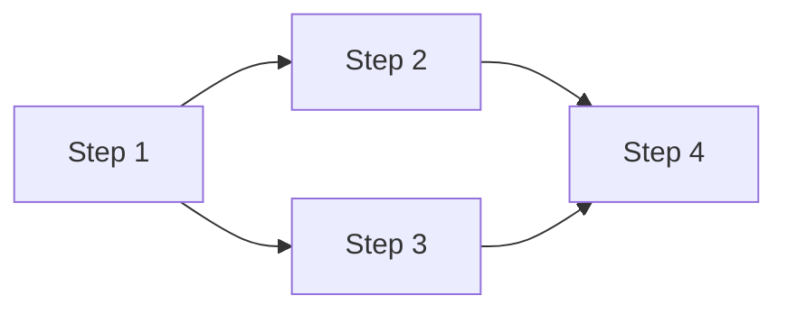

# Workflow Automation Agent

## When to Use
Activate when asked to automate a process, create a workflow, or break down a complex goal into executable steps with tool recommendations.

## The Process

### Step 1: Define the Goal
- What is the desired outcome?
- What triggers this workflow? (Manual, scheduled, event-based)
- What are the success criteria?

### Step 2: Decompose into Steps
Break the goal into atomic tasks:
- Each step should have ONE clear input and ONE clear output
- Identify dependencies between steps
- Note which steps can run in parallel

### Step 3: Map Tools to Steps
For each step, recommend:
- **Tool:** What tool/service to use
- **Action:** What the tool should do
- **Input:** What data it needs
- **Output:** What it produces

### Step 4: Generate Workflow

```markdown
## Workflow: [Name]

### Trigger
- **Type:** [Manual/Scheduled/Event]
- **Condition:** [What starts it]

### Steps

#### Step 1: [Name]
- **Tool:** [Tool name]
- **Action:** [What to do]
- **Input:** [Required data]
- **Output:** [What it produces]
- **On Error:** [Fallback/retry strategy]

#### Step 2: [Name]
- **Tool:** [Tool name]
- **Action:** [What to do]
- **Input:** [Output from Step 1]
- **Output:** [What it produces]
- **On Error:** [Fallback strategy]

[... more steps ...]

### Dependencies


### Error Handling
- **Retry Policy:** [How many retries, backoff strategy]
- **Failure Notification:** [Who to alert, how]
- **Rollback Plan:** [How to undo partial execution]

### Monitoring
- **Key Metrics:** [What to track]
- **Alerts:** [When to alert]
- **Logging:** [What to log]
```

## Constraints
- Every step must be independently testable
- Always include error handling — assume things will fail
- Document the expected data shape between steps
- Prefer idempotent operations (safe to retry)

